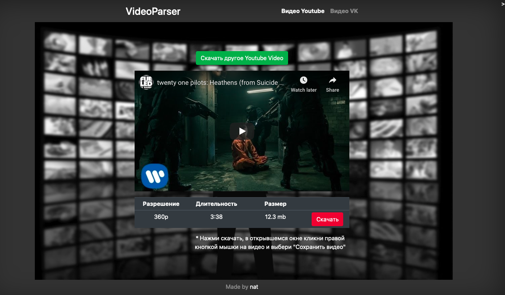

## Web service "VideoParser"

Webservice allows a client to download a video from VK / Youtube by link
__________
#### Installation

Install all used packages from requirements.txt (python 3.7).
In the terminal run : chmod +x run.sh  (once)
Every time you want to run an app, run this command in the terminal:  ./run.sh. 
__________
#### Content
   The project includes the following files:
   1. __init__.py
   2. vk.py (to parse a video from  VK)
   3. youtube.py (to parse a video from Youtube)
   4. add.py (skip it)
   5. requirements.txt (all used packages)
   6. a folder with html templates
   7. a folder with css styles (static) and background images
   8. run.sh 
   9. README.md
   10. .gitignore

__________
#### Additional references
   1. https://github.com/nficano/pytube/issues/642
   2. https://github.com/nficano/pytube/issues/301
   3. https://www.w3schools.com/bootstrap4/bootstrap_images.asp
   4. https://www.codingmedved.com/en-us/ 
   5. https://courses.prettyprinted.com/courses/
 
__________  
#### Additional info
Pytube3 was used to work with youtube. I had an issue with cipher and 
used "https://github.com/nficano/pytube/issues/642" to handle it (fixed this issue by changing 
a few lines in extract.py)

How it was before changes:
__________ 

cipher_url = [
                parse_qs(formats[i]["cipher"]) for i, data in enumerate(formats)
            ]

How it should look after changes:
__________ 

cipher_url = [
                parse_qs(formats[i]["signatureCipher"]) for i, data in enumerate(formats)
            ]
            
__________           
#### Instruction
   If you want to download video:
   1. go to the website and choose a type of video you want to download
   
    
   2. fill out a blank with a link and click "download"
   
   
   3. choose a video and click "download" (follow the instructionы below the button "download")
   
__________
#### Contact details
   natfr (telegram)
__________ 

